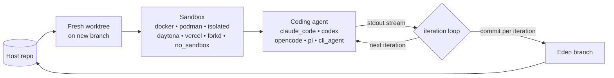

# Eden

[](https://github.com/dotbrains/eden/actions/workflows/ci.yml)
[](https://pypi.org/project/eden-agent/)
[](https://pypi.org/project/eden-agent/)
[](LICENSE)

Python orchestrator for AI coding agents in sandboxed git worktrees.

Eden creates a fresh git worktree on a new branch, runs a coding agent (Claude Code, Codex, opencode, pi, or any line-streaming CLI) inside a sandbox (Docker, Podman, isolated, Daytona, Vercel, or forkd microVMs), captures its output, and commits the changes back. You get a branch with one clean commit per iteration, ready to review or merge.



## Install

```bash
pip install eden-agent
```

Requires Python 3.11+.

## Quick example

The `simulated_agent` runs without any external CLI installed. Run this from inside a git repository:

```python
from pathlib import Path

from eden import run, simulated_agent
from eden.sandboxes.no_sandbox import provider as no_sandbox

result = run(
    cwd=Path.cwd(),
    sandbox=no_sandbox(),
    agent=simulated_agent(
        output="hello from the simulated agent\n<promise>COMPLETE</promise>\n",
    ),
    prompt="ignored by the simulated agent",
    max_iterations=1,
)

print(f"branch: {result.branch}")
print(f"iterations: {len(result.iterations)}")
```

For a real agent, scaffold a project:

```bash
eden init --sandbox docker --agent claude-code --yes
cp .eden/.env.example .eden/.env  # then fill in API keys
eden docker build-image
python .eden/main.py
```

## Development with Flox

Eden uses [Flox](https://flox.dev) in two distinct ways — don't conflate them:

1. **The repo dev toolchain** — the [`.flox/`](.flox/) environment that sets up *your* machine to work on Eden.
2. **Per-agent runtimes** — an optional, separate environment each agent declares for *its own* CLI.

### Repo dev toolchain

On Linux/macOS the repo ships a declarative, lockfile-pinned dev environment under [`.flox/`](.flox/). With Flox installed:

```bash
flox activate # provisions toolchain + builds .venv on first run
pytest -m "unit or e2e"
pre-commit run --all-files
```

`flox activate` provides Python 3.11/3.12/3.13, git, gh, the docker/podman clients, pre-commit, and make, then builds `.venv` via `pip install -e ".[dev]"`. Pick the interpreter with `EDEN_PYTHON` (e.g. `EDEN_PYTHON=python3.12 flox activate`; defaults to `python3.11`).

Flox is Linux/macOS only — on Windows, install directly with `python -m pip install -e ".[dev]"`. See [`AGENTS.md`](AGENTS.md#setup-and-development-commands) for the full command list.

### Per-agent runtimes

Separately, each **agent** can declare its own Flox runtime via `flox_env=` on its factory. Eden then runs that agent's CLI inside `flox activate -d <dir> -- <argv>`, so the agent gets a declared, lockfile-pinned toolchain instead of inheriting the host's. See [Agents — Per-agent Flox runtime](docs/agents.md#per-agent-flox-runtime).

## Documentation

Full documentation lives in [`docs/`](docs/README.md):

- [What is Eden?](docs/what-is-eden.md) — positioning and feature matrix
- [Quick start](docs/quick-start.md) — five-minute tour
- [Tutorial: build your first agent loop](docs/tutorial-first-loop.md) — 10-minute walkthrough that ends with a real agent fixing a real bug
- [After your first loop](docs/tutorial-first-loop-after-run.md) — inspect cost, replay transcripts, and choose the next reference
- [Python API reference](docs/python-api.md) — every name importable from `eden`
- [How it works](docs/how-it-works.md) — branch strategies, sandbox lifecycle, iteration loop
- [Sandbox providers](docs/sandbox-providers.md) — provider matrix and local provider catalog
- [Container sandbox providers](docs/container-sandbox-providers.md) — Docker and Podman details
- [Agents](docs/agents.md) — six agent factories

## License

[PolyForm Shield 1.0.0](LICENSE).
