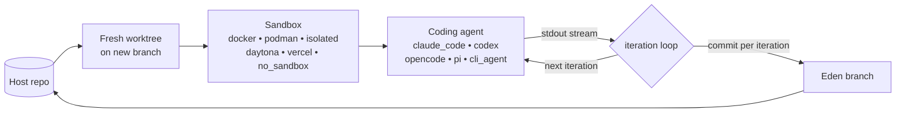

# Eden

[](https://github.com/dotbrains/eden/actions/workflows/ci.yml)
[](https://pypi.org/project/eden-agent/)
[](https://pypi.org/project/eden-agent/)
[](LICENSE)

Python orchestrator for AI coding agents in sandboxed git worktrees.

Eden creates a fresh git worktree on a new branch, runs a coding agent (Claude Code, Codex, opencode, pi, or any line-streaming CLI) inside a sandbox (Docker, Podman, isolated, Daytona, or Vercel), captures its output, and commits the changes back. You get a branch with one clean commit per iteration, ready to review or merge.



## Install

```bash
pip install eden-agent
```

Requires Python 3.11+.

## Quick example

The `simulated_agent` runs without any external CLI installed. Run this from inside a git repository:

```python
from pathlib import Path

from eden import run, simulated_agent
from eden.sandboxes.no_sandbox import provider as no_sandbox

result = run(
    cwd=Path.cwd(),
    sandbox=no_sandbox(),
    agent=simulated_agent(
        output="hello from the simulated agent\n<promise>COMPLETE</promise>\n",
    ),
    prompt="ignored by the simulated agent",
    max_iterations=1,
)

print(f"branch: {result.branch}")
print(f"iterations: {len(result.iterations)}")
```

For a real agent, scaffold a project:

```bash
eden init --sandbox docker --agent claude-code --yes
cp .eden/.env.example .env  # then fill in API keys
docker build -t eden:$(basename $(pwd)) -f .eden/Dockerfile .
python .eden/main.py
```

## Documentation

Full documentation lives in [`docs/`](docs/README.md):

- [What is Eden?](docs/what-is-eden.md) — positioning and feature matrix
- [Quick start](docs/quick-start.md) — five-minute tour
- [Python API reference](docs/python-api.md) — every name importable from `eden`
- [How it works](docs/how-it-works.md) — branch strategies, sandbox lifecycle, iteration loop
- [Sandbox providers](docs/sandbox-providers.md) — six provider catalog
- [Agents](docs/agents.md) — six agent factories

## License

[PolyForm Shield 1.0.0](LICENSE).
