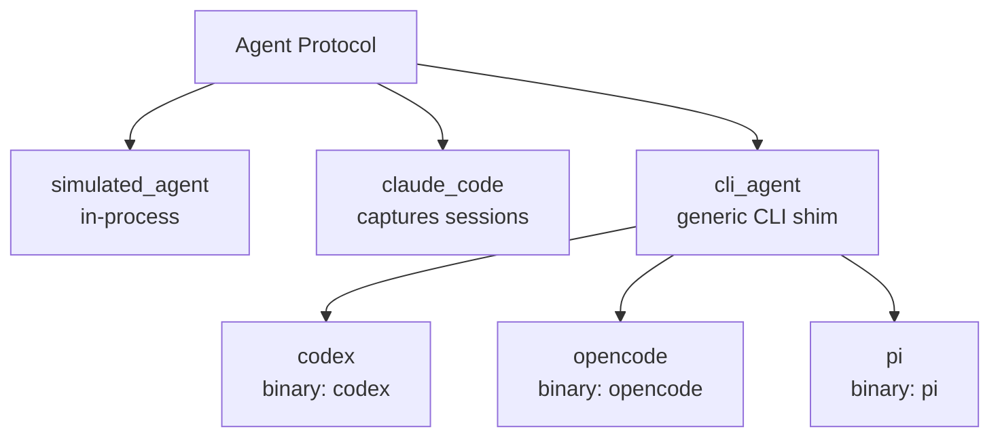

# Agents

An agent factory returns an object satisfying the [`Agent`](python-api.md#agent-protocol) Protocol. Eden ships factories for every major coding-agent CLI plus a generic `cli_agent` for anything else.

---

## Factory matrix

| Factory | Backed by | Default model | Session capture | Notes |
|---|---|---|---|---|
| `simulated_agent` | none (in-process) | `"deterministic-1"` | no | Emits a fixed output; uses an embedded Python interpreter as the "binary". |
| `claude_code` | `claude` CLI | required (`model` is positional) | yes (`captures_sessions=True` by default) | The only built-in agent that captures `~/.claude/projects/<slug>/<id>.jsonl`. |
| `codex` | `codex` CLI (via `cli_agent`) | `"gpt-5"` | no | Thin wrapper over `cli_agent`. |
| `opencode` | `opencode` CLI (via `cli_agent`) | `"claude-opus-4"` | no | Thin wrapper over `cli_agent`. |
| `pi` | `pi` CLI (via `cli_agent`) | `"pi-3.5"` | no | Thin wrapper over `cli_agent`. |
| `cli_agent` | any binary | `model` is required | configurable via `captures_sessions=` | Generic line-streaming CLI shim. |

Default models for the wrapper factories are illustrative — pass any model identifier the underlying CLI accepts. The `claude_code` factory has no default; pick a model explicitly.



## Importing

Every agent factory is re-exported from the top-level `eden` package:

```python
from eden import (
    simulated_agent,
    claude_code,
    codex,
    opencode,
    pi,
    cli_agent,
)
```

You can also import directly from each subpackage (`from eden.agents.codex import codex`), but the flat import is the conventional surface.

## `simulated_agent`

```python
from eden import simulated_agent

agent = simulated_agent(
    output="hello\n<promise>COMPLETE</promise>\n",
)
```

### Signature

```python
def simulated_agent(
    name: str = "simulated",
    model: str = "deterministic-1",
    *,
    output: str | list[str] | Callable[[IterationContext], str] = "<promise>COMPLETE</promise>\n",
    delay_per_line: float = 0.0,
    fail_with: Exception | None = None,
) -> Agent: ...
```

- `name` — agent identifier surfaced in `StreamEvent.agent_name`. Default `"simulated"`.
- `model` — informational model tag. Default `"deterministic-1"`.
- `output` — what the simulated CLI prints to stdout. A `str`, list of lines, or callable receiving the [`IterationContext`](python-api.md#iterationcontext).
- `delay_per_line` — seconds to sleep between lines (lets you exercise idle-warning logic). Default `0.0`.
- `fail_with` — when set, `build_command(ctx)` raises this exception instead of producing a command.

### What binary it wraps

None — `build_command` returns an argv that invokes the current Python interpreter (`sys.executable`) with an inlined script that prints the configured `output`. No external CLI is required.

### When to use

- Smoke-testing the orchestrator without an installed agent.
- Driving deterministic test fixtures in `tests/unit/` and `tests/e2e/`.
- Examples and documentation snippets that should run anywhere.

`captures_sessions` is not exposed; the simulated agent does not produce session JSONL.

## `claude_code`

```python
from eden import claude_code

agent = claude_code("claude-opus-4-7", effort="high")
```

### Signature

```python
def claude_code(
    model: str,
    *,
    name: str = "claude-code",
    effort: Literal["low", "medium", "high"] | None = None,
    env: Mapping[str, str] | None = None,
    capture_sessions: bool = True,
    dangerously_skip_permissions: bool = False,
    extra_args: tuple[str, ...] = (),
) -> _ClaudeCodeAgent: ...
```

- `model` — Claude model id, threaded into `--model`. Required (positional).
- `name` — agent identifier. Default `"claude-code"`.
- `effort` — optional `--thinking-effort` level (`"low"`, `"medium"`, `"high"`).
- `env` — per-agent environment additions; the orchestrator merges them with the host env.
- `capture_sessions` — when `True`, the orchestrator post-processes each iteration's session JSONL into `.eden/sessions/`. Default `True`.
- `dangerously_skip_permissions` — when `True`, appends `--dangerously-skip-permissions` so Claude does not block on per-tool permission prompts. Safe inside an isolated sandbox; think twice before enabling for `no_sandbox()`, where Claude would gain unprompted access to the host filesystem. Default `False`.
- `extra_args` — escape hatch for unsurfaced Claude CLI flags. Inserted before the stdin sigil (`-p -`).

### Argv shape

Eden builds `claude --print --output-format stream-json --verbose --model <model> [--thinking-effort ...] [--resume <id>] [--dangerously-skip-permissions] [extra_args...] -p -` and pipes the prompt via stdin. Stdin delivery dodges the Linux 128 KB execve argv-size limit, so prompts of any size are safe.

### Session capture and resume

`captures_sessions=True` is the default. The orchestrator watches `~/.claude/projects/<slug>/<id>.jsonl` and copies it to `.eden/sessions/<branch>/<iteration>.jsonl` after each iteration; `Iteration.session_id` and `Iteration.session_file_path` are populated. Set `capture_sessions=False` to skip this work.

To **resume** a captured session, pass `run(..., resume_session=<id>)` (top-level `run()` argument, not on the factory). Eden appends `--resume <id>` to the argv. Resume requires `max_iterations=1`; otherwise `InvalidOptions` is raised.

### What binary it wraps

The `claude` CLI from Anthropic (Claude Code). Must be installed and authenticated on `$PATH` at `run()` time.

### When to use

- Production runs against Claude Code.
- Workloads where preserving the chat transcript matters (audit, replay, debugging).

### When not to use

- Environments without the `claude` binary; reach for `simulated_agent` or another CLI agent instead.

## `codex`

```python
from eden import codex

agent = codex("gpt-5")
```

### Signature

```python
def codex(
    model: str = "gpt-5",
    *,
    effort: Literal["low", "medium", "high", "xhigh"] | None = None,
    env: Mapping[str, str] | None = None,
    extra_args: tuple[str, ...] = (),
) -> Agent: ...
```

Thin wrapper over [`cli_agent`](#cli_agent) with `binary="codex"` and `name="codex"`. `captures_sessions` is `False`.

### Options

- `effort` — optional reasoning-effort level. When set, threads `-c model_reasoning_effort="<level>"` into the codex invocation. One of `"low"`, `"medium"`, `"high"`, `"xhigh"`.

### What binary it wraps

The `codex` CLI from OpenAI. Must be on `$PATH`.

### When to use

- Codex-driven workflows where session capture isn't required.

The `"gpt-5"` default is illustrative — supply whatever model identifier your installed `codex` accepts.

## `opencode`

```python
from eden import opencode

agent = opencode("claude-opus-4")
```

### Signature

```python
def opencode(
    model: str = "claude-opus-4",
    *,
    variant: str | None = None,
    env: Mapping[str, str] | None = None,
    extra_args: tuple[str, ...] = (),
) -> Agent: ...
```

Builds the argv `opencode run --model <model> [--variant <v>] [extra_args] <prompt>`. `variant` controls reasoning effort (e.g. `"high"`, `"max"`, `"low"`, `"minimal"`); omit to keep opencode's default. Uses `cli_agent` under the hood with a custom argv builder; `captures_sessions` is `False`.

### What binary it wraps

The `opencode` CLI from `sst/opencode`. Must be on `$PATH`. opencode supports multiple model providers; the default `model="claude-opus-4"` is illustrative — pass whatever identifier opencode expects.

### When to use

- Multi-provider routing workflows (opencode lets you swap LLM backends without changing the calling code).

## `pi`

```python
from eden import pi

agent = pi("pi-3.5")
```

### Signature

```python
def pi(
    model: str = "pi-3.5",
    *,
    env: Mapping[str, str] | None = None,
    extra_args: tuple[str, ...] = (),
) -> Agent: ...
```

Thin wrapper over [`cli_agent`](#cli_agent) with `binary="pi"` and `name="pi"`. `captures_sessions` is `False`.

### What binary it wraps

The `pi` CLI from Inflection. Must be on `$PATH`.

### When to use

- pi-backed workflows.

## `cli_agent`

```python
from eden import cli_agent

agent = cli_agent(
    name="my-tool",
    model="some-model",
    binary="my-tool",
    extra_args=("--quiet",),
)
```

### Signature

```python
def cli_agent(
    *,
    name: str,
    model: str,
    binary: str,
    build_argv: Callable[[IterationContext], list[str]] | None = None,
    parse_stream: Callable[[str], StreamEvent | None] | None = None,
    captures_sessions: bool = False,
    env: Mapping[str, str] | None = None,
    extra_args: tuple[str, ...] = (),
) -> Agent: ...
```

All arguments are keyword-only.

- `name` — agent identifier (used in `StreamEvent.agent_name`). Required.
- `model` — informational model identifier. Required (no default).
- `binary` — executable name resolved through `$PATH` at subprocess-spawn time. Required.
- `build_argv` — override the default argv; receives the [`IterationContext`](python-api.md#iterationcontext). Default produces `[binary, *extra_args, ctx.prompt]`.
- `parse_stream` — override the default line-to-`StreamEvent` parser. Default returns `None` (orchestrator falls back to emitting a `text` event per line).
- `captures_sessions` — opt-in to the session post-processing the orchestrator runs for `claude_code`. Default `False`.
- `env` — per-agent environment additions. Merged by the orchestrator.
- `extra_args` — inserted between the binary and the prompt by the default `build_argv`.

### What binary it wraps

Whatever you pass as `binary`. The codex/opencode/pi factories are 5-line wrappers over `cli_agent` that fix `binary=` and a default `model=`.

### When to use

- Any line-streaming CLI agent Eden doesn't ship a dedicated factory for.
- Integrating internal or experimental agents — wire them up via `cli_agent` first; promote to a dedicated factory once they stabilise.
- Custom argv shapes or stream parsers (pass `build_argv=` and `parse_stream=`).

## Authentication

Each agent reads its own credentials from environment variables, per its own documentation (`ANTHROPIC_API_KEY` for `claude-code`, `OPENAI_API_KEY` for `codex`, etc.). Eden does not manage agent auth — the host environment is forwarded into the agent process via `subprocess`/`exec`. See [configuration.md](configuration.md#variables-eden-does-not-read) for the variables Eden does *not* read.

## See also

- [Python API: Agents](python-api.md#agents) — full Protocol and factory reference.
- [Custom providers](custom-providers.md) — for sandbox-side provider authoring (the agent side stays unchanged).
- [How it works](how-it-works.md) — where `build_command(ctx)` and `parse_stream(line)` plug into the iteration loop.
- [ADR 0003 — One agent per file](adr/0003-one-agent-per-file.md) — the rationale behind the per-agent subpackage layout.
