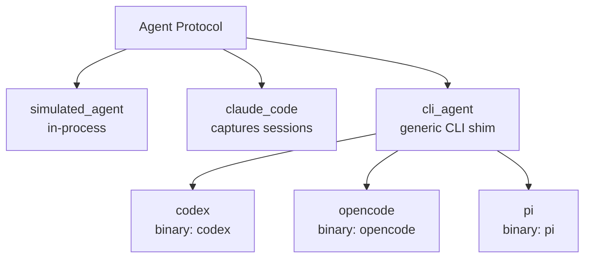

# Agents

An agent factory returns an object satisfying the [`Agent`](python-api.md#agent-protocol) Protocol. Eden ships factories for every major coding-agent CLI plus a generic `cli_agent` for anything else.

---

## Factory matrix

| Factory | Backed by | Default model | Session capture | Notes |
|---|---|---|---|---|
| `simulated_agent` | none (in-process) | `"deterministic-1"` | no | Emits a fixed output; uses an embedded Python interpreter as the "binary". |
| `claude_code` | `claude` CLI | required (`model` is positional) | yes (`captures_sessions=True` by default) | The only built-in agent that captures `~/.claude/projects/<slug>/<id>.jsonl`. |
| `codex` | `codex` CLI (via `cli_agent`) | `"gpt-5"` | no | Thin wrapper over `cli_agent`. |
| `opencode` | `opencode` CLI (via `cli_agent`) | `"claude-opus-4"` | no | Thin wrapper over `cli_agent`. |
| `pi` | `pi` CLI (via `cli_agent`) | `"pi-3.5"` | no | Thin wrapper over `cli_agent`. |
| `cli_agent` | any binary | `model` is required | configurable via `captures_sessions=` | Generic line-streaming CLI shim. |

Default models for the wrapper factories are illustrative — pass any model identifier the underlying CLI accepts. The `claude_code` factory has no default; pick a model explicitly.



## Importing

Every agent factory is re-exported from the top-level `eden` package:

```python
from eden import (
    simulated_agent,
    claude_code,
    codex,
    opencode,
    pi,
    cli_agent,
)
```

You can also import directly from each subpackage (`from eden.agents.codex import codex`), but the flat import is the conventional surface.

## `simulated_agent`

```python
from eden import simulated_agent

agent = simulated_agent(
    output="hello\n<promise>COMPLETE</promise>\n",
)
```

### Signature

```python
def simulated_agent(
    name: str = "simulated",
    model: str = "deterministic-1",
    *,
    output: str | list[str] | Callable[[IterationContext], str] = "<promise>COMPLETE</promise>\n",
    delay_per_line: float = 0.0,
    fail_with: Exception | None = None,
) -> Agent: ...
```

- `name` — agent identifier surfaced in `StreamEvent.agent_name`. Default `"simulated"`.
- `model` — informational model tag. Default `"deterministic-1"`.
- `output` — what the simulated CLI prints to stdout. A `str`, list of lines, or callable receiving the [`IterationContext`](python-api.md#iterationcontext).
- `delay_per_line` — seconds to sleep between lines (lets you exercise idle-warning logic). Default `0.0`.
- `fail_with` — when set, `build_command(ctx)` raises this exception instead of producing a command.

### What binary it wraps

None — `build_command` returns an argv that invokes the current Python interpreter (`sys.executable`) with an inlined script that prints the configured `output`. No external CLI is required.

### When to use

- Smoke-testing the orchestrator without an installed agent.
- Driving deterministic test fixtures in `tests/unit/` and `tests/e2e/`.
- Examples and documentation snippets that should run anywhere.

`captures_sessions` is not exposed; the simulated agent does not produce session JSONL.

## `claude_code`

```python
from eden import claude_code

agent = claude_code("claude-opus-4-7", effort="high")
```

### Signature

```python
def claude_code(
    model: str,
    *,
    name: str = "claude-code",
    effort: Literal["low", "medium", "high"] | None = None,
    env: Mapping[str, str] | None = None,
    capture_sessions: bool = True,
    dangerously_skip_permissions: bool = False,
    permission_mode: Literal["default", "acceptEdits", "plan", "bypassPermissions"] | None = None,
    extra_args: tuple[str, ...] = (),
) -> _ClaudeCodeAgent: ...
```

- `model` — Claude model id, threaded into `--model`. Required (positional).
- `name` — agent identifier. Default `"claude-code"`.
- `effort` — optional `--thinking-effort` level (`"low"`, `"medium"`, `"high"`).
- `env` — per-agent environment additions; the orchestrator merges them with the host env.
- `capture_sessions` — when `True`, the orchestrator post-processes each iteration's session JSONL into `.eden/sessions/`. Default `True`.
- `dangerously_skip_permissions` — when `True`, appends `--dangerously-skip-permissions` so Claude does not block on per-tool permission prompts. Safe inside an isolated sandbox; think twice before enabling for `no_sandbox()`, where Claude would gain unprompted access to the host filesystem. Equivalent to `permission_mode="bypassPermissions"`. Default `False`.
- `permission_mode` — graduated tool-approval control, appended as `--permission-mode <mode>`: `"default"` (prompt per tool), `"acceptEdits"` (auto-accept file edits, prompt for the rest), `"plan"` (plan only, no edits), or `"bypassPermissions"` (skip all prompts). Use this instead of the all-or-nothing `dangerously_skip_permissions` for a middle ground — e.g. `"acceptEdits"` for safe autonomous editing or `"plan"` for a read-only planning iteration. Mirrors upstream's `claudeCode(model, { permissionMode })`. Mutually exclusive with `dangerously_skip_permissions=True` (passing both raises `InvalidOptions`). Default `None` (omit the flag).
- `extra_args` — escape hatch for unsurfaced Claude CLI flags. Inserted before the stdin sigil (`-p -`).

### Argv shape

Eden builds `claude --print --output-format stream-json --verbose --model <model> [--thinking-effort ...] [--resume <id>] [--dangerously-skip-permissions] [--permission-mode <mode>] [extra_args...] -p -` and pipes the prompt via stdin. Stdin delivery dodges the Linux 128 KB execve argv-size limit, so prompts of any size are safe.

### Session capture and resume

`captures_sessions=True` is the default. The orchestrator watches `~/.claude/projects/<slug>/<id>.jsonl` and copies it to `.eden/sessions/<branch>/<iteration>.jsonl` after each iteration; `Iteration.session_id` and `Iteration.session_file_path` are populated. Set `capture_sessions=False` to skip this work.

To **resume** a captured session, pass `run(..., resume_session=<id>)` (top-level `run()` argument, not on the factory). Eden appends `--resume <id>` to the argv. Resume requires `max_iterations=1`; otherwise `InvalidOptions` is raised.

### What binary it wraps

The `claude` CLI from Anthropic (Claude Code). Must be installed and authenticated on `$PATH` at `run()` time.

### When to use

- Production runs against Claude Code.
- Workloads where preserving the chat transcript matters (audit, replay, debugging).

### When not to use

- Environments without the `claude` binary; reach for `simulated_agent` or another CLI agent instead.

## `codex`

```python
from eden import codex

agent = codex("gpt-5")
```

### Signature

```python
def codex(
    model: str = "gpt-5",
    *,
    name: str = "codex",
    effort: Literal["low", "medium", "high", "xhigh"] | None = None,
    env: Mapping[str, str] | None = None,
    capture_sessions: bool = True,
    dangerously_bypass_approvals_and_sandbox: bool = True,
    approvals_reviewer: Literal["user", "auto_review"] | None = None,
    extra_args: tuple[str, ...] = (),
) -> Agent: ...
```

Builds the invocation `codex exec [resume <id>] --json [--dangerously-bypass-approvals-and-sandbox] -m <model> [-c model_reasoning_effort="<level>"] [extra_args ...]` and delivers the prompt via stdin.

### Options

- `effort` — optional reasoning-effort level. When set, threads `-c model_reasoning_effort="<level>"` into the invocation. One of `"low"`, `"medium"`, `"high"`, `"xhigh"`.
- `capture_sessions` — when `True` (default), the orchestrator post-processes each iteration's session JSONL into `.eden/sessions/` via [`CodexSessionStorage`](python-api.md#codexsessionstorage). Resume a captured session via the top-level `run(..., resume_session=<id>)` (requires `max_iterations=1`).
- `dangerously_bypass_approvals_and_sandbox` — when `True` (default), appends `--dangerously-bypass-approvals-and-sandbox` so codex does not block on per-tool approval prompts. Safe inside an isolated sandbox; think twice before enabling for `no_sandbox()`. Superseded by `approvals_reviewer="auto_review"`.
- `approvals_reviewer` — maps to codex's `approvals_reviewer` config key (`-c approvals_reviewer="<value>"`). When `"auto_review"`, swaps the bypass flag for an interactive approval policy plus codex's most permissive sandbox (`-a on-request -s danger-full-access`), so an AI reviewer mediates per-action approvals instead of skipping them outright — eden's sandbox provider still owns the outer filesystem boundary. `"user"` (and unset) keep the default bypass behaviour. An unrecognised value raises `InvalidOptions`.

### parse_stream

Decodes codex JSONL events: `thread.started` → `session_id`, `item.completed`/`agent_message` → `text`, `item.started`/`command_execution` → `tool_call` (Bash), `error` → `text`. Live display, file logs, and `on_agent_stream_event` callbacks see structured events instead of one-line-per-token noise.

### What binary it wraps

The `codex` CLI from OpenAI. Must be on `$PATH`. The `"gpt-5"` default is illustrative — supply whatever model identifier your installed `codex` accepts.

### When to use

- Codex-driven workflows with or without session capture/resume.

## `opencode`

```python
from eden import opencode

agent = opencode("claude-opus-4")
```

### Signature

```python
def opencode(
    model: str = "claude-opus-4",
    *,
    name: str = "opencode",
    variant: str | None = None,
    agent: str | None = None,
    env: Mapping[str, str] | None = None,
    dangerously_skip_permissions: bool = False,
    extra_args: tuple[str, ...] = (),
) -> Agent: ...
```

Builds the argv `opencode run --format json --model <model> [--variant <v>] [--agent <name>] [--dangerously-skip-permissions] [extra_args] <prompt>`. `--format json` is always present so the bundled stream parser receives structured events; without it, opencode would emit free-form text and the orchestrator's per-line fallback would silently drop session ids and tool calls.

`captures_sessions` is `False` (no `OpenCodeSessionStorage` ships today; the parser does surface `step_start` events so `Iteration.session_id` populates).

### Options

- `variant` — reasoning-effort variant passed via `--variant` (e.g. `"high"`, `"max"`, `"low"`, `"minimal"`); omit to keep opencode's default.
- `agent` — named agent mode passed via `--agent` (e.g. `"build"` / `"plan"`); selects a different built-in opencode persona per mode.
- `dangerously_skip_permissions` — when `True`, appends `--dangerously-skip-permissions` so opencode does not block on per-tool permission prompts. Safe inside isolated sandboxes; think twice before enabling for `no_sandbox()`. Default `False`.

### parse_stream

Decodes opencode JSONL events: `step_start` → `session_id`, `text`/`part.type==text` → `text`, `tool_use`/`part.type==tool` (only on `state.status=="completed"`) → `tool_call`, `error` → `text`.

### What binary it wraps

The `opencode` CLI from `sst/opencode`. Must be on `$PATH`. opencode supports multiple model providers; the default `model="claude-opus-4"` is illustrative — pass whatever identifier opencode expects.

### When to use

- Multi-provider routing workflows (opencode lets you swap LLM backends without changing the calling code).

## `pi`

```python
from eden import pi

agent = pi("pi-3.5")
```

### Signature

```python
def pi(
    model: str = "pi-3.5",
    *,
    env: Mapping[str, str] | None = None,
    extra_args: tuple[str, ...] = (),
) -> Agent: ...
```

Thin wrapper over [`cli_agent`](#cli_agent) with `binary="pi"` and `name="pi"`. `captures_sessions` is `False`. Wires a `parse_stream` that decodes pi JSONL events (`message_update`/`text_delta` → `text`, `tool_execution_start` → `tool_call` for known tools (Bash, WebSearch, WebFetch, Agent), `agent_end` → final-message `text`, `agent_error`/`error` → `text`) so live display and file logs see structured events instead of one-line-per-token noise.

### What binary it wraps

The `pi` CLI from Inflection. Must be on `$PATH`.

## `cursor`

```python
from eden import cursor

agent = cursor("claude-sonnet-4-6")
```

### Signature

```python
def cursor(
    model: str = "claude-sonnet-4-6",
    *,
    name: str = "cursor",
    env: Mapping[str, str] | None = None,
    force: bool = False,
    extra_args: tuple[str, ...] = (),
) -> Agent: ...
```

Builds `agent --print --output-format stream-json --model <model> [--force] [extra_args ...] <prompt>`. Cursor's CLI binary is named `agent` (not `cursor`); make sure it's on `$PATH`. The prompt is passed positionally with a ~120 KB pre-flight guard — long prompts raise `InvalidOptions(code="config.prompt_too_long")` before spawn so you don't hit `OSError: [Errno 7] Argument list too long`. `captures_sessions` is `False`; resume is not supported.

### Options

- `force` — when `True`, appends `--force` so cursor does not block on per-tool permission prompts. Cursor's equivalent of Claude's `dangerously_skip_permissions`. Default `False`.

### parse_stream

Decodes cursor's `tool_call` events and delegates Claude-compatible `assistant`/`result` event shapes to Claude's parser.

### When to use

- Cursor-driven workflows where session capture isn't required.

## `copilot`

```python
from eden import copilot

agent = copilot("claude-sonnet-4", effort="high")
```

### Signature

```python
def copilot(
    model: str = "claude-sonnet-4",
    *,
    name: str = "copilot",
    effort: Literal["low", "medium", "high"] | None = None,
    env: Mapping[str, str] | None = None,
    allow_all_tools: bool = False,
    extra_args: tuple[str, ...] = (),
) -> Agent: ...
```

Builds `copilot -p <prompt> --output-format json --model <model> [--allow-all-tools] [--effort <level>] [extra_args ...]`. Prompt is delivered via `-p` (still argv); same ~120 KB pre-flight guard as `cursor()`. `captures_sessions` is `False`; resume is not supported.

### Options

- `effort` — reasoning-effort level (`"low"`, `"medium"`, `"high"`). When set, threads `--effort <level>` into the invocation.
- `allow_all_tools` — when `True`, appends `--allow-all-tools` so Copilot does not block on per-tool permission prompts. Copilot's equivalent of Claude's `dangerously_skip_permissions`. Default `False`.

### parse_stream

Decodes Copilot JSONL events: `assistant.message_delta` → `text`, `tool.execution_start` → `tool_call` (normalises lowercase `"bash"` → `"Bash"` for parity with the other agents), `result` → `session_id`, `error`/`agent_error` → `text`.

### When to use

- GitHub-Copilot-driven workflows; the only first-party big-vendor CLI Eden ships outside of Claude.

### When to use

- pi-backed workflows.

## `cli_agent`

```python
from eden import cli_agent

agent = cli_agent(
    name="my-tool",
    model="some-model",
    binary="my-tool",
    extra_args=("--quiet",),
)
```

### Signature

```python
def cli_agent(
    *,
    name: str,
    model: str,
    binary: str,
    build_argv: Callable[[IterationContext], list[str]] | None = None,
    parse_stream: Callable[[str], StreamEvent | None] | None = None,
    captures_sessions: bool = False,
    env: Mapping[str, str] | None = None,
    extra_args: tuple[str, ...] = (),
) -> Agent: ...
```

All arguments are keyword-only.

- `name` — agent identifier (used in `StreamEvent.agent_name`). Required.
- `model` — informational model identifier. Required (no default).
- `binary` — executable name resolved through `$PATH` at subprocess-spawn time. Required.
- `build_argv` — override the default argv; receives the [`IterationContext`](python-api.md#iterationcontext). Default produces `[binary, *extra_args, ctx.prompt]`.
- `parse_stream` — override the default line-to-`StreamEvent` parser. Default returns `None` (orchestrator falls back to emitting a `text` event per line).
- `captures_sessions` — opt-in to the session post-processing the orchestrator runs for `claude_code`. Default `False`.
- `env` — per-agent environment additions. Merged by the orchestrator.
- `extra_args` — inserted between the binary and the prompt by the default `build_argv`.

### What binary it wraps

Whatever you pass as `binary`. The codex/opencode/pi factories are 5-line wrappers over `cli_agent` that fix `binary=` and a default `model=`.

### When to use

- Any line-streaming CLI agent Eden doesn't ship a dedicated factory for.
- Integrating internal or experimental agents — wire them up via `cli_agent` first; promote to a dedicated factory once they stabilise.
- Custom argv shapes or stream parsers (pass `build_argv=` and `parse_stream=`).

## Per-agent Flox runtime

Every CLI-backed factory (`claude_code`, `codex`, `opencode`, `pi`, `cursor`, `copilot`, `cli_agent`) accepts an optional `flox_env`:

```python
import eden

agent = eden.claude_code(
    model="claude-opus-4-7",
    flox_env="envs/claude",  # a dir containing .flox/env/manifest.toml
)
```

When `flox_env` is set, the orchestrator runs that agent's CLI inside the declared environment by wrapping its argv:

```
flox activate -d <flox_env> -- <agent argv...>
```

so each agent **type** gets its own declared, lockfile-pinned toolchain instead of inheriting whatever happens to be on the host. This mirrors [blacksmith's per-identity Flox env](https://github.com/dotbrains/blacksmith/pull/2): an agent's runtime is part of its definition, not an ambient property of the machine.

Create one with Flox:

```bash
mkdir -p envs/claude && cd envs/claude && flox init
flox install nodejs   # whatever the agent CLI needs
```

**Enforced when present.** Declaring a `flox_env` is opt-in, but once declared it is enforced — Eden validates it once, before the first iteration, and fails fast with [`FloxEnvError`](errors.md#floxenverror) when:

- the directory has no `.flox/env/manifest.toml` (a dangling reference), or
- the `flox` binary is not on `PATH`.

Agents that don't set `flox_env` are completely unchanged — no wrapping, no validation.

**Escape hatch.** Set `EDEN_ALLOW_NO_FLOX=1` to skip activation when `flox` is unavailable (Windows, or CI legs without Flox). The agent then runs with the host toolchain, as if no `flox_env` were declared. A missing manifest still fails — the escape hatch only covers a missing `flox` binary.

**Sandbox interaction.** For batch runs (`eden.run()`) and `no_sandbox`, the wrap runs on the host. In **interactive** sessions against container providers (`docker`/`podman`), the wrapped argv runs *inside* the container via `interactive_exec`, so `flox` and the env directory must exist in the image. Validation always runs against the host path.

## Authentication

Each agent reads its own credentials from environment variables, per its own documentation (`ANTHROPIC_API_KEY` for `claude-code`, `OPENAI_API_KEY` for `codex`, etc.). Eden does not manage agent auth — the host environment is forwarded into the agent process via `subprocess`/`exec`. See [configuration.md](configuration.md#variables-eden-does-not-read) for the variables Eden does *not* read.

## See also

- [Python API: Agents](python-api.md#agents) — full Protocol and factory reference.
- [Custom providers](custom-providers.md) — for sandbox-side provider authoring (the agent side stays unchanged).
- [How it works](how-it-works.md) — where `build_command(ctx)` and `parse_stream(line)` plug into the iteration loop.
- [ADR 0003 — One agent per file](adr/0003-one-agent-per-file.md) — the rationale behind the per-agent subpackage layout.
- [ADR 0014 — Per-agent Flox runtime](adr/0014-per-agent-flox-runtime.md) — the rationale behind `flox_env`.
