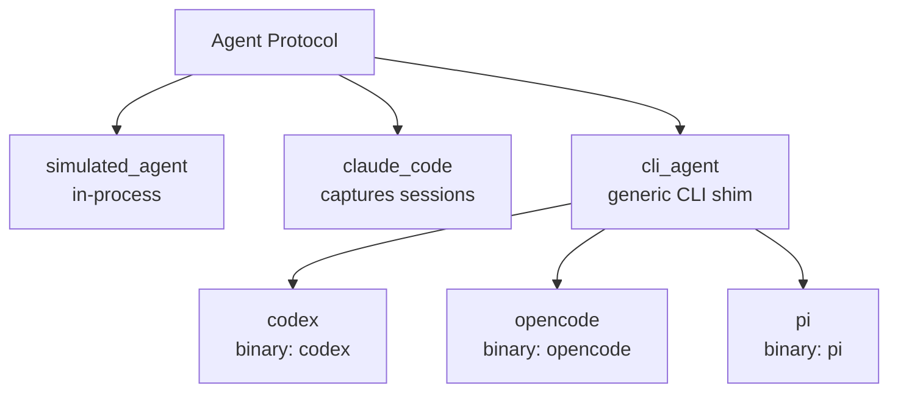

# Agents

An agent factory returns an object satisfying the [`Agent`](python-api.md#agent-protocol) Protocol. Eden ships factories for every major coding-agent CLI plus a generic `cli_agent` for anything else.

---

## Factory matrix

| Factory | Backed by | Default model | Session capture | Notes |
|---|---|---|---|---|
| `simulated_agent` | none (in-process) | `"deterministic-1"` | no | Emits a fixed output; uses an embedded Python interpreter as the "binary". |
| `claude_code` | `claude` CLI | required (`model` is positional) | yes (`captures_sessions=True` by default) | The only built-in agent that captures `~/.claude/projects/<slug>/<id>.jsonl`. |
| `codex` | `codex` CLI (via `cli_agent`) | `"gpt-5.4"` | no | Thin wrapper over `cli_agent`. |
| `opencode` | `opencode` CLI (via `cli_agent`) | `"claude-opus-4"` | no | Thin wrapper over `cli_agent`. |
| `pi` | `pi` CLI (via `cli_agent`) | `"pi-3.5"` | no | Thin wrapper over `cli_agent`. |
| `cursor` | Cursor CLI (`agent`) | `"claude-sonnet-4-6"` | no | Stream-json wrapper for Cursor. |
| `copilot` | GitHub Copilot CLI | `"claude-sonnet-4"` | no | JSON wrapper for Copilot coding-agent runs. |
| `cli_agent` | any binary | `model` is required | configurable via `captures_sessions=` | Generic line-streaming CLI shim. |

Default models for the wrapper factories are illustrative — pass any model identifier the underlying CLI accepts. The `claude_code` factory has no default; pick a model explicitly.



## Importing

Every agent factory is re-exported from the top-level `eden` package:

```python
from eden import (
    simulated_agent,
    claude_code,
    codex,
    opencode,
    pi,
    cursor,
    copilot,
    cli_agent,
)
```

You can also import directly from each subpackage (`from eden.agents.codex import codex`), but the flat import is the conventional surface.

## Factory Reference

Detailed per-factory options moved to [Agent factories](agent-factories.md), [Claude Code agent](agent-claude-code.md), [Agent CLI factories](agent-cli-factories.md), [Agent CLI other factories](agent-cli-other-factories.md), and [Agent CLI editor factories](agent-cli-editor-factories.md).

### `simulated_agent`

Moved to [`simulated_agent`](agent-factories.md#simulated_agent).

### `claude_code`

Moved to [`claude_code`](agent-claude-code.md#claude_code).

### `codex`

Moved to [`codex`](agent-factories.md#codex).

### `opencode`

Moved to [`opencode`](agent-cli-other-factories.md#opencode).

### `pi`

Moved to [`pi`](agent-cli-other-factories.md#pi).

### `cursor`

Moved to [`cursor`](agent-cli-editor-factories.md#cursor).

### `copilot`

Moved to [`copilot`](agent-cli-editor-factories.md#copilot).

### `cli_agent`

Moved to [`cli_agent`](agent-factories.md#cli_agent).

## Per-agent Flox runtime

Moved to [Agent Flox runtime](agent-flox-runtime.md).

## Authentication

Each agent reads its own credentials from environment variables, per its own documentation (`ANTHROPIC_API_KEY` for `claude-code`, `OPENAI_API_KEY` for `codex`, etc.). Eden does not manage agent auth — the host environment is forwarded into the agent process via `subprocess`/`exec`. See [configuration.md](configuration.md#variables-eden-does-not-read) for the variables Eden does *not* read.

## See also

- [Python API: Agents](python-api.md#agents) — full Protocol and factory reference.
- [Agent factories](agent-factories.md) — `simulated_agent` arguments and behavior.
- [Claude Code agent](agent-claude-code.md) — `claude_code` arguments and transcript capture.
- [Agent CLI factories](agent-cli-factories.md) — Codex argv shape and stream parser.
- [Agent CLI other factories](agent-cli-other-factories.md) — opencode and pi argv shapes.
- [Agent CLI editor factories](agent-cli-editor-factories.md) — Cursor and Copilot factory options.
- [Agent Flox runtime](agent-flox-runtime.md) — per-agent toolchain activation.
- [Custom providers](custom-providers.md) — for sandbox-side provider authoring (the agent side stays unchanged).
- [How it works](how-it-works.md) — where `build_command(ctx)` and `parse_stream(line)` plug into the iteration loop.
- [ADR 0003 — One agent per file](adr/0003-one-agent-per-file.md) — the rationale behind the per-agent subpackage layout.
- [ADR 0014 — Per-agent Flox runtime](adr/0014-per-agent-flox-runtime.md) — the rationale behind `flox_env`.
