# Custom provider protocols

Detailed `SandboxProvider` and handle Protocol reference for out-of-tree sandbox
providers. See [Custom providers](custom-providers.md) for when to write one and
[Custom provider guide](custom-provider-guide.md) for a skeleton implementation.

## Protocol surface

Eden defines four Protocols in `eden/providers/_protocols.py`. Three are
runtime-checkable; the fourth (`SandboxProvider`) is the factory contract.

```mermaid
classDiagram
    class SandboxProvider {
        <<Protocol>>
        +name: str
        +kind: bind_mount|isolated|none
        +supports_strategy(strategy) bool
        +create(opts) SandboxHandle
    }
    class SandboxHandle {
        <<Protocol>>
        +worktree_path: Path
        +exec(cmd, on_line, ...) ExecResult
        +copy_file_in(src, dst)
        +copy_file_out(src, dst)
        +close()
    }
    class BindMountSandboxHandle {
        <<Protocol>>
    }
    class IsolatedSandboxHandle {
        <<Protocol>>
        +finalize(target) FinalizeResult
    }

    SandboxHandle <|-- BindMountSandboxHandle
    SandboxHandle <|-- IsolatedSandboxHandle
    SandboxProvider ..> SandboxHandle : create&#40;&#41; returns
```



### `SandboxProvider`

The factory side. Your `provider(...)` factory must return an instance
satisfying this Protocol. Prefer [`make_bind_mount_provider`](#make_bind_mount_provider)
or [`make_isolated_provider`](#make_isolated_provider) over a bespoke class.

All four Protocols, both factories, and every supporting type are re-exported
from the top-level `eden` package, so out-of-tree providers can import them
without depending on `eden.providers._protocols` directly:

```python
from eden import (
    BindMountSandboxHandle,
    BranchStrategy,
    CreateOptions,
    ExecResult,
    FinalizeResult,
    IsolatedSandboxHandle,
    Mount,
    SandboxHandle,
    SandboxProvider,
    make_bind_mount_provider,
    make_isolated_provider,
)
```

`kind` controls the orchestrator's behavior:

- `"bind_mount"` - host filesystem is mounted into the sandbox; no `finalize()`.
- `"isolated"` - sandbox is detached; orchestrator calls
  `handle.finalize(target)` after each iteration.
- `"none"` - degenerate "sandbox" that just runs on the host (`no_sandbox`).

### `SandboxHandle`

The runtime-checkable handle Protocol every provider's `create()` must return.

```python
from collections.abc import Callable, Mapping
from pathlib import Path
from typing import Protocol, runtime_checkable

from eden import ExecResult

@runtime_checkable
class SandboxHandle(Protocol):
    worktree_path: Path

    def exec(
        self,
        cmd: str,
        *,
        on_line: Callable[[str], None] | None = None,
        cwd: Path | None = None,
        env: Mapping[str, str] | None = None,
        timeout: float | None = None,
        stdin: str | None = None,
    ) -> ExecResult: ...

    def copy_file_in(self, host: Path, sandbox: Path) -> None: ...

    def copy_file_out(self, sandbox: Path, host: Path) -> None: ...

    def close(self) -> None: ...
```

- `worktree_path` - sandbox-side path the orchestrator passes to the agent as
  `cwd`. For bind-mount providers this is the host worktree; for isolated
  providers it is a sandbox-local path (for example, `/workspace`).
- `exec(cmd, *, on_line, cwd, env, timeout, stdin)` - run a shell command. The
  provider chooses how to evaluate the string (`/bin/sh -c`, REST shell, etc.).
  `on_line` is invoked once per stdout line. `stdin` carries payloads larger
  than the 128KB Linux execve argv limit; REST providers wrap with
  `printf <base64> | base64 -d | (cmd)`.
- `copy_file_in` / `copy_file_out` - single-file transfers between host and
  sandbox. Used by hooks and session capture.
- `close()` - release resources. Called in a `finally` block; should not raise.

### `BindMountSandboxHandle`

A marker Protocol that adds no methods over `SandboxHandle`. It lets the
orchestrator narrow types when it knows a handle is bind-mount.

### `IsolatedSandboxHandle`

The handle Protocol for detached / patch-sync / cloud sandboxes.

```python
from eden import FinalizeResult

@runtime_checkable
class IsolatedSandboxHandle(SandboxHandle, Protocol):
    def finalize(self, target: Path) -> FinalizeResult: ...
```

`finalize(target)` replays sandbox-side state onto the host worktree (`target`).
The orchestrator detects the Protocol via `hasattr(handle, "finalize")`, so any
handle exposing the method works. The runtime-checkable Protocol is for
type-checker narrowing.

`IsolatedSandboxHandle` is re-exported from the top-level `eden` package, so
out-of-tree providers can `from eden import IsolatedSandboxHandle` without
depending on `eden.providers._protocols` directly. See
[python-api.md#isolatedsandboxhandle](python-api.md#isolatedsandboxhandle).

## Supporting types

Read these from `eden/providers/_types.py`. All are frozen dataclasses.

### `CreateOptions`

The single argument the orchestrator hands to your `create()` callable.

```python
@dataclass(frozen=True)
class CreateOptions:
    branch: str
    worktree_path: Path
    host_repo_path: Path
    env: Mapping[str, str]
    mounts: tuple[Mount, ...]
    name_hint: str | None
```

- `branch` - the worktree's branch name.
- `worktree_path` - host path the orchestrator carved.
- `host_repo_path` - root of the user's repo (parent of `.eden/`).
- `env` - environment variables to forward into the sandbox.
- `mounts` - extra bind mounts the caller requested via the provider factory.
- `name_hint` - `run(name=...)` value, useful for cloud sandbox names.

### `ExecResult`

```python
@dataclass(frozen=True)
class ExecResult:
    stdout: str
    stderr: str
    exit_code: int

    @property
    def ok(self) -> bool: ...
    def check(self) -> ExecResult: ...
```

`check()` raises [`ExecFailed`](errors.md) if `exit_code != 0`. Returned by
every `handle.exec(...)` call.

### `FinalizeResult`

```python
@dataclass(frozen=True)
class FinalizeResult:
    applied: bool
    files_changed: tuple[Path, ...]
    patch_size_bytes: int
```

What `IsolatedSandboxHandle.finalize(target)` returns. `applied=False` means at
least one copy or unlink failed; failures are logged and the orchestrator
continues.

### `Mount`, `BranchStrategy`

See [python-api.md#configuration-types](python-api.md#configuration-types).
Your factory accepts `mounts: tuple[Mount, ...]` from the caller and threads
them through to `CreateOptions`.

## Factory helpers

Eden ships two top-level factories that wrap a `create` callable into a
`SandboxProvider`.

### `make_bind_mount_provider`

```python
provider = make_bind_mount_provider(name="my-provider", create=my_create_fn)
```

Use for any provider where the host worktree is the sandbox (host == sandbox
filesystem). The orchestrator will not call `finalize()` on the returned handle.
Pass `supported_strategies=` to restrict the default set (`head`,
`merge_to_head`, `named`).

### `make_isolated_provider`

```python
provider = make_isolated_provider(name="my-provider", create=my_create_fn)
```

Use for detached, patch-sync, or cloud providers. The handle returned by
`create` must expose `finalize(target) -> FinalizeResult`.
