# Custom providers

Implement the `SandboxProvider` Protocol — and one of `BindMountSandboxHandle` or `IsolatedSandboxHandle` for the handle it produces — to plug your own sandbox into `eden.run(sandbox=...)`.

---

## When to write one

The six in-tree providers (`no_sandbox`, `docker`, `podman`, `isolated`, `daytona`, `vercel`) cover most workflows; see [sandbox-providers.md](sandbox-providers.md) for the matrix. Reach for a custom provider when:

- You target a runtime Eden does not ship — Firecracker, gVisor, Kata, Nomad, Kubernetes Jobs, Modal, E2B, Fly Machines, Lambda, RunPod, or your own VM fleet.
- You need a transport Eden does not ship — gRPC, SSH, WebSocket, etc.
- You want to wrap an existing in-tree provider with extra behavior (telemetry, caching, custom mount semantics).

If your provider only adds bind-mount semantics to a different container runtime, copy `eden/sandboxes/podman/__init__.py` — it is a 30-line file that delegates to `make_container_provider`.

## Protocol surface

Eden defines four Protocols in `eden/providers/_protocols.py`. Three are runtime-checkable; the fourth (`SandboxProvider`) is the factory contract.

```mermaid
classDiagram
    class SandboxProvider {
        <<Protocol>>
        +name: str
        +kind: bind_mount|isolated|none
        +supports_strategy(strategy) bool
        +create(opts) SandboxHandle
    }
    class SandboxHandle {
        <<Protocol>>
        +worktree_path: Path
        +exec(cmd, on_line, ...) ExecResult
        +copy_file_in(src, dst)
        +copy_file_out(src, dst)
        +close()
    }
    class BindMountSandboxHandle {
        <<Protocol>>
    }
    class IsolatedSandboxHandle {
        <<Protocol>>
        +finalize(target) FinalizeResult
    }

    SandboxHandle <|-- BindMountSandboxHandle
    SandboxHandle <|-- IsolatedSandboxHandle
    SandboxProvider ..> SandboxHandle : create&#40;&#41; returns
```



### `SandboxProvider`

The factory side. Your `provider(...)` factory must return an instance satisfying this Protocol — use [`make_bind_mount_provider`](#make_bind_mount_provider) or [`make_isolated_provider`](#make_isolated_provider) instead of writing a bespoke class unless you have a reason.

All four Protocols, both factories, and every supporting type are re-exported from the top-level `eden` package, so out-of-tree providers can import them without depending on `eden.providers._protocols` directly:

```python
from eden import (
    BindMountSandboxHandle,
    BranchStrategy,
    CreateOptions,
    ExecResult,
    FinalizeResult,
    IsolatedSandboxHandle,
    Mount,
    SandboxHandle,
    SandboxProvider,
    make_bind_mount_provider,
    make_isolated_provider,
)
```

```python
from typing import Literal, Protocol

from eden import BranchStrategy, CreateOptions, SandboxHandle


class SandboxProvider(Protocol):
    name: str
    kind: Literal["bind_mount", "isolated", "none"]

    def supports_strategy(self, strategy: BranchStrategy) -> bool: ...

    def create(self, opts: CreateOptions) -> SandboxHandle: ...
```

`kind` controls the orchestrator's behavior:

- `"bind_mount"` — host filesystem is mounted into the sandbox; no `finalize()` step.
- `"isolated"` — sandbox is detached; orchestrator calls `handle.finalize(target)` after each iteration.
- `"none"` — degenerate "sandbox" that just runs on the host (`no_sandbox`).

### `SandboxHandle`

The base handle Protocol every provider's `create()` must return. Runtime-checkable.

```python
from collections.abc import Callable, Mapping
from pathlib import Path
from typing import Protocol, runtime_checkable

from eden import ExecResult


@runtime_checkable
class SandboxHandle(Protocol):
    worktree_path: Path

    def exec(
        self,
        cmd: str,
        *,
        on_line: Callable[[str], None] | None = None,
        cwd: Path | None = None,
        env: Mapping[str, str] | None = None,
        timeout: float | None = None,
    ) -> ExecResult: ...

    def copy_file_in(self, host: Path, sandbox: Path) -> None: ...

    def copy_file_out(self, sandbox: Path, host: Path) -> None: ...

    def close(self) -> None: ...
```

- `worktree_path` — sandbox-side path the orchestrator passes to the agent as `cwd`. For bind-mount providers this is the host worktree; for isolated providers it is a sandbox-local path (e.g. `/workspace`).
- `exec(cmd, *, on_line, cwd, env, timeout)` — run a shell command. `cmd` is a string (not argv); the provider chooses how to evaluate it (`/bin/sh -c`, REST shell, etc.). `on_line` is invoked once per stdout line as the command runs (use it to forward to the orchestrator's streaming layer).
- `copy_file_in` / `copy_file_out` — single-file transfers between host and sandbox. Used by hooks and session capture.
- `close()` — release resources. Called in a `finally` block; should not raise.

### `BindMountSandboxHandle`

A marker Protocol — adds no methods over `SandboxHandle`. Lets the orchestrator narrow types when it knows a handle is bind-mount.

```python
@runtime_checkable
class BindMountSandboxHandle(SandboxHandle, Protocol):
    """Marker — bind-mount providers don't add methods."""
```

### `IsolatedSandboxHandle`

The handle Protocol for detached / patch-sync / cloud sandboxes. Adds one method.

```python
from eden import FinalizeResult


@runtime_checkable
class IsolatedSandboxHandle(SandboxHandle, Protocol):
    def finalize(self, target: Path) -> FinalizeResult: ...
```

`finalize(target)` replays the sandbox-side state onto the host worktree (`target`). The orchestrator detects the Protocol via `hasattr(handle, "finalize")`, so any handle exposing the method works — the runtime-checkable Protocol is for type-checker narrowing.

`IsolatedSandboxHandle` is re-exported from the top-level `eden` package, so out-of-tree providers can `from eden import IsolatedSandboxHandle` without depending on `eden.providers._protocols` directly. See [python-api.md#isolatedsandboxhandle](python-api.md#isolatedsandboxhandle).

## Supporting types

Read these from `eden/providers/_types.py`. All are frozen dataclasses.

### `CreateOptions`

The single argument the orchestrator hands to your `create()` callable.

```python
@dataclass(frozen=True)
class CreateOptions:
    branch: str
    worktree_path: Path
    host_repo_path: Path
    env: Mapping[str, str]
    mounts: tuple[Mount, ...]
    name_hint: str | None
```

- `branch` — the worktree's branch name.
- `worktree_path` — host path the orchestrator carved.
- `host_repo_path` — root of the user's repo (parent of `.eden/`).
- `env` — environment variables to forward into the sandbox.
- `mounts` — extra bind mounts the caller requested via the provider factory.
- `name_hint` — `run(name=...)` value, useful for cloud sandbox names.

### `ExecResult`

```python
@dataclass(frozen=True)
class ExecResult:
    stdout: str
    stderr: str
    exit_code: int

    @property
    def ok(self) -> bool: ...
    def check(self) -> ExecResult: ...
```

`check()` raises [`ExecFailed`](errors.md) if `exit_code != 0`. Returned by every `handle.exec(...)` call.

### `FinalizeResult`

```python
@dataclass(frozen=True)
class FinalizeResult:
    applied: bool
    files_changed: tuple[Path, ...]
    patch_size_bytes: int
```

What `IsolatedSandboxHandle.finalize(target)` returns. `applied=False` means at least one copy or unlink failed; failures are logged and the orchestrator continues.

### `Mount`, `BranchStrategy`

See [python-api.md#configuration-types](python-api.md#configuration-types) for the public dataclasses. Your factory accepts `mounts: tuple[Mount, ...]` from the caller and threads them through to `CreateOptions`.

## Factory helpers

Eden ships two factories that wrap a `create` callable into a `SandboxProvider` so you do not have to write the boilerplate yourself. Both are re-exported from the top-level `eden` package.

### `make_bind_mount_provider`

```python
from collections.abc import Callable
from eden import (
    BindMountSandboxHandle,
    CreateOptions,
    SandboxProvider,
    make_bind_mount_provider,
)
from eden.providers import StrategyTag


def make_bind_mount_provider(
    name: str,
    create: Callable[[CreateOptions], BindMountSandboxHandle],
    *,
    supported_strategies: frozenset[StrategyTag] = frozenset(
        {"head", "merge_to_head", "named"}
    ),
) -> SandboxProvider: ...
```

Use for any provider where the host worktree is the sandbox (host == sandbox filesystem). The orchestrator will not call `finalize()` on the returned handle.

### `make_isolated_provider`

```python
from eden import IsolatedSandboxHandle, SandboxProvider, make_isolated_provider


def make_isolated_provider(
    name: str,
    create: Callable[[CreateOptions], IsolatedSandboxHandle],
    *,
    supported_strategies: frozenset[StrategyTag] = frozenset(
        {"head", "merge_to_head", "named"}
    ),
) -> SandboxProvider: ...
```

Use for detached, patch-sync, or cloud providers. The handle returned by `create` MUST expose `finalize(target) -> FinalizeResult`.

## Skeleton: a custom isolated provider

A minimum viable cloud-style provider. Replace the bodies with REST calls or whatever transport you target. Type-checks against the actual Protocols.

```python
"""my_provider: example custom isolated sandbox."""

from __future__ import annotations

from collections.abc import Callable, Mapping
from dataclasses import dataclass
from pathlib import Path

from eden import (
    CreateOptions,
    ExecResult,
    FinalizeResult,
    IsolatedSandboxHandle,
    SandboxProvider,
    make_isolated_provider,
)


@dataclass
class _MyHandle:
    worktree_path: Path  # sandbox-side path
    host_worktree_path: Path  # host worktree the orchestrator carved

    def exec(
        self,
        cmd: str,
        *,
        on_line: Callable[[str], None] | None = None,
        cwd: Path | None = None,
        env: Mapping[str, str] | None = None,
        timeout: float | None = None,
    ) -> ExecResult:
        # Run `cmd` in the sandbox. Stream stdout via on_line(line).
        # Return an ExecResult populated with stdout, stderr, exit_code.
        raise NotImplementedError

    def copy_file_in(self, host: Path, sandbox: Path) -> None:
        # Push `host` (host path) to `sandbox` (sandbox path).
        raise NotImplementedError

    def copy_file_out(self, sandbox: Path, host: Path) -> None:
        # Pull `sandbox` (sandbox path) to `host` (host path).
        raise NotImplementedError

    def finalize(self, target: Path) -> FinalizeResult:
        # Replay sandbox-side changes onto `target` (host worktree path).
        # Return what was applied; orchestrator logs the result.
        return FinalizeResult(applied=True, files_changed=(), patch_size_bytes=0)

    def close(self) -> None:
        # Release resources. Called in a finally block; do not raise.
        return None


def provider(*, endpoint: str = "https://example.invalid") -> SandboxProvider:
    fixed_endpoint = endpoint

    def _create(opts: CreateOptions) -> IsolatedSandboxHandle:
        # 1. Provision the sandbox via your transport (REST, gRPC, SSH...).
        # 2. Upload opts.worktree_path contents into the sandbox.
        # 3. Snapshot the baseline so finalize() can diff against it.
        sandbox_workdir = Path("/workspace")
        return _MyHandle(
            worktree_path=sandbox_workdir,
            host_worktree_path=opts.worktree_path,
        )

    return make_isolated_provider(name="my-provider", create=_create)


__all__ = ["provider"]
```

Plug it into `run()`:

```python
from eden import run, simulated_agent
from my_pkg.eden_provider import provider as my_provider

result = run(
    agent=simulated_agent(output="<promise>COMPLETE</promise>\n"),
    sandbox=my_provider(endpoint="https://my-runtime.example.com"),
    prompt="echo hello",
    max_iterations=1,
)
```

## Worked examples in-tree

Read these for full implementations of each shape:

- **Bind-mount, host-side** — `eden/sandboxes/no_sandbox/__init__.py`. ~60 LoC.
- **Bind-mount, container** — `eden/sandboxes/docker/__init__.py` and `eden/providers/_impl/container.py`. Delegates to a shared container helper.
- **Patch-sync, local** — `eden/sandboxes/isolated/__init__.py`. Copy-tree, snapshot, run, diff, apply.
- **REST cloud, isolated** — `eden/sandboxes/daytona/__init__.py`. Provisions a remote sandbox over REST, snapshots via `find -exec sha256sum`, pulls changed files in `finalize()`, and reuses `eden.providers._impl.patch_sync` for the apply step.
- **Test providers** — `eden/sandboxes/test_bind_mount/__init__.py` and `eden/sandboxes/test_isolated/__init__.py`. Filesystem-only providers that carve a tmpdir per `create()` call. Both expose a `CallLog` so tests can assert on the orchestrator's traffic, and accept an `exec_handler` callable to stub responses without spawning real subprocesses. Use them as a copy-paste starting point for your own provider.

```python
from eden import run, simulated_agent
from eden.sandboxes.test_bind_mount import CallLog, provider as test_bind_mount

log = CallLog()
result = run(
    sandbox=test_bind_mount(call_log=log),
    agent=simulated_agent(output="<promise>COMPLETE</promise>\n"),
    prompt="ignored",
    max_iterations=1,
)
assert log.closed is True
```

## Conventions worth following

- **Idempotent close** — `close()` is called from a `finally` block. Catch transport exceptions; never raise from `close()`.
- **Lazy credential checks** — raise `ProviderUnavailable` from `create()`, not from your `provider(...)` factory. This lets users import the factory without credentials in scope (matches `daytona`, `vercel`).
- **No `.git` / `.eden` upload** — the in-tree providers exclude these paths from the snapshot; do the same to keep finalize diffs small and avoid leaking session state into the sandbox.
- **Reuse `patch_sync`** — `eden.providers._impl.patch_sync` exposes `snapshot()`, `diff()`, and `apply()` so isolated providers do not have to reimplement the diff logic. `daytona` and `isolated` both use it.

## See also

- [Python API: `IsolatedSandboxHandle`](python-api.md#isolatedsandboxhandle) — public re-export consumers can import from the top-level package.
- [Sandbox providers](sandbox-providers.md) — the in-tree provider catalog and matrix.
- [How it works](how-it-works.md) — where `create()`, `exec()`, and `finalize()` plug into the iteration loop.
- [Errors](errors.md) — `SandboxError` family raised by providers (`ProviderUnavailable`, `ExecFailed`, `ExecTimeout`, `UnsupportedStrategy`).
- [ADR 0001 — Finalizing vs. direct handles](adr/0001-finalizing-vs-direct-handles.md) — why `finalize()` is a per-iteration call rather than a streaming sync.
