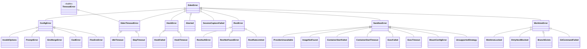

# Error hierarchy

Inheritance diagram for Eden errors. See [Errors](errors.md) for conventions,
class links, and recovery references.

## Hierarchy

```mermaid
classDiagram
    class EdenError
    class TimeoutError {
        <<builtin>>
    }

    class ConfigError
    class HookError
    class EdenTimeoutError
    class Aborted
    class SessionCaptureFailed
    class RestError
    class SandboxError
    class WorktreeError

    EdenError <|-- ConfigError
    EdenError <|-- HookError
    EdenError <|-- EdenTimeoutError
    EdenError <|-- Aborted
    EdenError <|-- SessionCaptureFailed
    EdenError <|-- RestError
    EdenError <|-- SandboxError
    EdenError <|-- WorktreeError
    TimeoutError <|-- EdenTimeoutError

    ConfigError <|-- InvalidOptions
    ConfigError <|-- PromptError
    ConfigError <|-- EnvMergeError
    ConfigError <|-- CwdError
    ConfigError <|-- FloxEnvError

    HookError <|-- HookFailed
    HookError <|-- HookTimeout

    EdenTimeoutError <|-- IdleTimeout
    EdenTimeoutError <|-- StepTimeout

    RestError <|-- RestAuthError
    RestError <|-- RestNotFoundError
    RestError <|-- RestRateLimited

    SandboxError <|-- ProviderUnavailable
    SandboxError <|-- ImageNotFound
    SandboxError <|-- ContainerStartFailed
    SandboxError <|-- ContainerStartTimeout
    SandboxError <|-- ExecFailed
    SandboxError <|-- ExecTimeout
    SandboxError <|-- MountConfigError
    SandboxError <|-- UnsupportedStrategy

    WorktreeError <|-- WorktreeLocked
    WorktreeError <|-- DirtyHostBlocked
    WorktreeError <|-- BranchExists
    WorktreeError <|-- GitCommandFailed
```
