# Errors

Every error Eden raises descends from `EdenError`. Catch the base class to handle anything; catch a specific subclass to handle one failure mode.

## Conventions

Each concrete error in `eden/errors.py` carries the same shape:

- `code: str` — stable, dotted identifier (e.g. `hook.timeout`, `rest.rate_limited`). Suitable for routing and structured logging.
- `message: str` — human-readable summary.
- `hint: str | None` — optional remediation hint surfaced in the formatted string.
- `cause: Exception | None` — the originating exception, stored as a named attribute. `cause` does **not** set `__cause__`; if you want chained tracebacks, raise with `raise XError(..., cause=e) from e`.

Formatted message shape: `[<code>] <message>` followed by `\nhint: <hint>` when present.

`EdenTimeoutError` additionally subclasses the built-in `TimeoutError`, so `except TimeoutError:` catches Eden's idle/step timeouts alongside any other code's `TimeoutError`s.

The errors below are split into three groups:

1. **Top-level `EdenError` subclasses** — re-exported from `eden`. These are the ones you import and catch in user code.
2. **`SandboxError` family** — raised by sandbox providers in `eden.sandboxes`. Importable from `eden.sandboxes.errors`.
3. **`WorktreeError` family** — raised by `eden.worktree`. Importable from `eden.worktree.errors`.

All three families share `EdenError` as a common ancestor.

## Hierarchy

```mermaid
classDiagram
    class EdenError
    class TimeoutError {
        <<builtin>>
    }

    class ConfigError
    class HookError
    class EdenTimeoutError
    class Aborted
    class SessionCaptureFailed
    class RestError
    class SandboxError
    class WorktreeError

    EdenError <|-- ConfigError
    EdenError <|-- HookError
    EdenError <|-- EdenTimeoutError
    EdenError <|-- Aborted
    EdenError <|-- SessionCaptureFailed
    EdenError <|-- RestError
    EdenError <|-- SandboxError
    EdenError <|-- WorktreeError
    TimeoutError <|-- EdenTimeoutError

    ConfigError <|-- InvalidOptions
    ConfigError <|-- PromptError
    ConfigError <|-- EnvMergeError
    ConfigError <|-- CwdError
    ConfigError <|-- FloxEnvError

    HookError <|-- HookFailed
    HookError <|-- HookTimeout

    EdenTimeoutError <|-- IdleTimeout
    EdenTimeoutError <|-- StepTimeout

    RestError <|-- RestAuthError
    RestError <|-- RestNotFoundError
    RestError <|-- RestRateLimited

    SandboxError <|-- ProviderUnavailable
    SandboxError <|-- ImageNotFound
    SandboxError <|-- ContainerStartFailed
    SandboxError <|-- ExecFailed
    SandboxError <|-- ExecTimeout
    SandboxError <|-- MountConfigError
    SandboxError <|-- UnsupportedStrategy

    WorktreeError <|-- WorktreeLocked
    WorktreeError <|-- DirtyHostBlocked
    WorktreeError <|-- BranchExists
    WorktreeError <|-- GitCommandFailed
```



Module locations:
- `EdenError` and the top-level subclasses live in `eden/errors.py`.
- `SandboxError` family lives in `eden/sandboxes/errors.py`.
- `WorktreeError` family lives in `eden/worktree/errors.py`.

## Top-level errors

### `EdenError`

Base class for everything Eden raises. Catch this to handle any Eden failure uniformly.

```python
from eden import EdenError

try:
    run(...)
except EdenError as e:
    log.error("eden failed: %s", e)
```

### `ConfigError`

Base for problems detected before any side effect — bad arguments, environment, or `cwd`. If you see one of these, nothing was created and nothing was started.

#### `InvalidOptions`

Generic kwarg-validation failure. Carries `code`, `message`, `hint`, `cause`. Raised when the orchestrator detects mutually-exclusive or missing-required arguments to `run(...)` (e.g., supplying both `prompt` and `prompt_file`).

**Recovery:** fix the call site.

#### `PromptError`

Raised when prompt rendering fails — missing `{name}` arg substitution, malformed `!\`shell\`` block, unreadable `prompt_file`, etc. Carries `code`, `message`, `hint`, `cause`.

**Recovery:** inspect `e.code` (e.g. `prompt.missing_arg`, `prompt.shell_failed`) and fix the prompt source.

#### `EnvMergeError`

Conflicting `env` overrides between caller, agent, and provider. Default `code="config.env_merge"`.

**Recovery:** drop the conflicting key from one layer or rename it.

#### `CwdError`

The `cwd=` argument is missing, not a directory, or not inside a git repo. Default `code="config.cwd"`.

**Recovery:** pass a valid path inside a git repo. `cd` into the repo before running, or pass `cwd=Path("/abs/path/to/repo")`.

#### `FloxEnvError`

An agent declared a `flox_env` that can't be activated: the directory has no `.flox/env/manifest.toml`, or the `flox` binary isn't on `PATH`. Raised before the first iteration (fail-fast), so a dangling reference surfaces immediately rather than mid-run. Default `code="config.flox_env"`. See [agents.md](agents.md#per-agent-flox-runtime).

**Recovery:** point `flox_env` at a directory containing `.flox/env/manifest.toml` (run `flox init` there), install Flox so the env can be activated, or set `EDEN_ALLOW_NO_FLOX=1` to run without it (Windows / CI smoke tests). Drop the `flox_env` declaration to restore the prior host-toolchain behavior.

### `HookError`

Base for host- and sandbox-hook failures.

#### `HookFailed`

A hook's command exited non-zero. Default `code="hook.failed"`. The orchestrator stops the run after the failing hook; subsequent hooks in the same phase do not run.

**Recovery:** check `e.cause` (when present) and fix the hook command, or remove the hook from the bundle.

#### `HookTimeout`

A hook exceeded its `timeout` (per-hook override, or `Timeouts.hook_step`). Default `code="hook.timeout"`.

**Recovery:** raise the timeout with `Timeouts(hook_step=...)` or per-hook `Hook(..., timeout=...)`, or simplify the hook.

### `EdenTimeoutError`

Base for time-budget exceedances. Subclasses `builtins.TimeoutError`, so `except TimeoutError:` works too.

#### `IdleTimeout`

Agent stdout was silent past `idle_timeout`. Default `code="timeout.idle"`. Raised by the orchestrator's idle watcher; the partially-completed iteration is committed before the exception propagates.

**Recovery:** raise `idle_timeout` with `run(idle_timeout=...)`, or investigate why the agent stopped emitting (network stalls, infinite loops, prompt issues). `idle_warning_interval` lets you observe the silence in real time before it trips.

#### `StepTimeout`

A single iteration exceeded `Timeouts.iteration_step`. Default `code="timeout.step"`. Distinct from `IdleTimeout` in that the agent may still be talking — this fires on total elapsed time, not silence.

**Recovery:** raise `Timeouts(iteration_step=...)`, or split the work across more iterations.

### `Aborted`

Raised when cooperative cancellation lands — usually via `AbortController.abort()` from another thread, or by `AbortSignal.raise_if_aborted()` inside a hook. Carries `reason: str` (default `"abort-signal"`).

**Recovery:** intentional. Treat the same as a successful early exit; partial commits are preserved.

### `SessionCaptureFailed`

The orchestrator could not locate, read, or write the Claude Code session JSONL. Default `code="session.capture_failed"`. **Soft failure** — the orchestrator catches it internally and surfaces a warning event instead of aborting the run; you only see this exception if you opt into stricter handling.

**Recovery:** none required — the run completes. Inspect `e.cause` for `OSError`/`PermissionError` if you need to diagnose.

### `RestError`

Base for non-2xx responses from cloud-provider REST APIs (`daytona`, `vercel`, future cloud providers). Carries the standard fields plus:

- `status: int` — HTTP status (`0` for connection-level failures with no HTTP response).
- `body: str` — response body if available.
- `url: str` — request URL.

Default `code="rest.error"`. Catch this at the orchestrator boundary; never let the provider's `requests.RequestException` leak through.

#### `RestAuthError`

401 / 403 — Bearer token rejected or insufficient permissions. Default `code="rest.auth"`.

**Recovery:** rotate or refresh the API token (`DAYTONA_API_KEY`, `VERCEL_TOKEN`, etc.); verify the org/team scope.

#### `RestNotFoundError`

404 — sandbox, project, or file does not exist on the cloud side. Default `code="rest.not_found"`. Notably, `daytona`/`vercel` `close()` swallows this for the sandbox-delete call (idempotent teardown).

**Recovery:** the resource is gone; treat as terminal unless the resource ID is known-stale, in which case stop using it.

#### `RestRateLimited`

429 — server-side rate-limit; eden's automatic retries were exhausted. Default `code="rest.rate_limited"`.

**Recovery:** retry with backoff, parallelize fewer runs, or upgrade the provider plan.

## Sandbox errors

Moved to [Sandbox and worktree errors](sandbox-worktree-errors.md#sandbox-errors).

### `SandboxError`

Moved to [Sandbox and worktree errors](sandbox-worktree-errors.md#sandboxerror).

### `ProviderUnavailable`

Moved to [Sandbox and worktree errors](sandbox-worktree-errors.md#providerunavailable).

### `ImageNotFound`

Moved to [Sandbox and worktree errors](sandbox-worktree-errors.md#imagenotfound).

### `ContainerStartFailed`

Moved to [Sandbox and worktree errors](sandbox-worktree-errors.md#containerstartfailed).

### `ExecFailed`

Moved to [Sandbox and worktree errors](sandbox-worktree-errors.md#execfailed).

### `ExecTimeout`

Moved to [Sandbox and worktree errors](sandbox-worktree-errors.md#exectimeout).

### `MountConfigError`

Moved to [Sandbox and worktree errors](sandbox-worktree-errors.md#mountconfigerror).

### `UnsupportedStrategy`

Moved to [Sandbox and worktree errors](sandbox-worktree-errors.md#unsupportedstrategy).

## Worktree errors

Moved to [Sandbox and worktree errors](sandbox-worktree-errors.md#worktree-errors).

### `WorktreeError`

Moved to [Sandbox and worktree errors](sandbox-worktree-errors.md#worktreeerror).

### `WorktreeLocked`

Moved to [Sandbox and worktree errors](sandbox-worktree-errors.md#worktreelocked).

### `DirtyHostBlocked`

Moved to [Sandbox and worktree errors](sandbox-worktree-errors.md#dirtyhostblocked).

### `BranchExists`

Moved to [Sandbox and worktree errors](sandbox-worktree-errors.md#branchexists).

### `GitCommandFailed`

Moved to [Sandbox and worktree errors](sandbox-worktree-errors.md#gitcommandfailed).

## Recovery patterns at a glance

Moved to [Error recovery](error-recovery.md#recovery-patterns-at-a-glance).

## Catching everything

Moved to [Error recovery](error-recovery.md#catching-everything).

## See also

- [Python API: Errors](python-api.md#errors) — the 16 public error classes by name.
- [Python API: Cancellation](python-api.md#cancellation) — `AbortController` / `AbortSignal` / `Aborted`.
- [Error recovery](error-recovery.md) — handling strategies and catch-all examples.
- [Configuration](configuration.md) — env vars whose absence raises `ProviderUnavailable`.
- [Sandbox and worktree errors](sandbox-worktree-errors.md) — provider and worktree error families.
- [Sandbox providers](sandbox-providers.md) — which provider raises which `SandboxError` subclass.
- [How it works](how-it-works.md) — where each error fires in the iteration loop.
