# How Eden works

Eden's run loop has four phases: worktree setup, sandbox creation, agent iteration, and finalize.

---

## Worktree setup

`create_worktree()` (called internally by `run()`) carves a fresh git worktree under `.eden/worktrees/` on a new branch. Three branch strategies are available — see [`BranchStrategy`](python-api.md#configuration-types):

- `BranchStrategy.head()` — work directly on the host repo's `HEAD`. No new branch, no merge. Refuses to start if the host tree is dirty.
- `BranchStrategy.merge_to_head(base)` — generated `eden/<slug>` branch off `base`. Eden may merge it back on success.
- `BranchStrategy.named(branch, base)` — explicit branch off `base`, preserved as-is.

Read source: `eden/worktree/_create.py`.

A per-branch advisory file lock (`eden/worktree/_lock.py`) under `.eden/worktrees/<slug>.lock` prevents two concurrent runs from racing on the same branch. The lock records the holder PID; if the holder is dead the next acquirer wipes the stale lock and continues. Concurrent runs on _different_ branches do not block each other.

## Sandbox creation

The worktree path is handed to a `SandboxProvider`, which materialises an environment where the agent runs. Providers fall into three categories:

- **Bind-mount** (`no_sandbox`, `docker`, `podman`) — the worktree path is mounted directly into the sandbox. Reads and writes happen in-place on the host filesystem. No post-run sync is needed.
- **Patch-sync** (`isolated`) — files are copied into a sandbox directory. After the run, `finalize()` returns a `FinalizeResult` whose patch is applied back to the host worktree.
- **Cloud** (`daytona`, `vercel`) — files are uploaded over REST. After the run, `finalize()` downloads the diff and replays it onto the host worktree.

```mermaid
flowchart LR
    Worktree[Host worktree] --> Bind{provider category}
    Bind -->|bind-mount| BM[no_sandbox<br/>docker<br/>podman]
    Bind -->|patch-sync| PS[isolated]
    Bind -->|cloud| CL[daytona<br/>vercel]
    BM -->|edits in place| Worktree
    PS -->|finalize&#40;&#41; patch| Worktree
    CL -->|REST download diff| Worktree
```



See [sandbox-providers.md](sandbox-providers.md) for the full provider matrix.

## Agent iteration

For each iteration (default 1, capped by `max_iterations`):

1. The orchestrator renders the prompt (see [prompts.md](prompts.md)).
2. It invokes `agent.build_command(ctx)` to obtain the argv. `ctx` is an [`IterationContext`](python-api.md#iterationcontext) carrying the iteration index, rendered prompt, sandbox handle, worktree path, branch, and run name.
3. It spawns the agent process inside the sandbox via the handle's `exec(...)`.
4. It streams stdout line-by-line, calling `agent.parse_stream(line)` for each line.
5. Yielded `StreamEvent`s drive logging, idle-warning emission, completion-signal matching, and tool-call accounting.
6. When the agent exits — whether by hitting the completion signal, exhausting iterations, idle timeout, abort signal, or step timeout — the orchestrator commits any changes on the worktree branch.

## Finalize

For non-bind-mount providers, the orchestrator calls `handle.finalize(target)` after the run, where `target` is the host worktree path. The returned `FinalizeResult` reports whether the patch was applied, which files changed, and the patch size in bytes.

Bind-mount providers do not implement `finalize()` — their changes are already on disk. The orchestrator detects the protocol via `hasattr(handle, "finalize")`.

See [`FinalizeResult`](python-api.md#finalizeresult) and [custom-providers.md](custom-providers.md).

## Lifecycle hooks

Hooks fire at five named phases. The `HookPhase` enum:

- `OnWorktreeReady` — host-only, after the worktree is carved.
- `OnSandboxReady` — sandbox-only, after the sandbox is created.
- `OnIterationStart` — host and sandbox, before each iteration.
- `OnIterationEnd` — host and sandbox, after each iteration commits.
- `OnClose` — host and sandbox, on run exit (success or failure).

Hooks come in two flavors:

- **Host hooks** (`HostHooks`) run on your machine via subprocess. `on_sandbox_ready` is sandbox-only; the host bundle exposes the other four.
- **Sandbox hooks** (`SandboxHooks`) run inside the sandbox via `handle.exec(...)`. The sandbox bundle exposes all phases except `on_worktree_ready` (which fires before any sandbox exists).

A hook that exits non-zero raises `HookFailed`; one that exceeds its timeout raises `HookTimeout`. Both subclass `HookError`.

See [python-api.md#lifecycle-hooks](python-api.md#lifecycle-hooks) for the type reference.

## Iteration loop diagram

```mermaid
sequenceDiagram
    participant Caller as Caller
    participant Run as run()
    participant Host as HostHooks
    participant SB as Sandbox
    participant Box as SandboxHooks
    participant Agent

    Caller->>Run: run(...)
    Run->>Run: create_worktree()
    Run->>Host: on_worktree_ready
    Run->>SB: create sandbox
    SB->>Box: on_sandbox_ready

    loop each iteration (1..max_iterations)
        Run->>Host: on_iteration_start
        Run->>Box: on_iteration_start
        Run->>Run: render prompt
        Run->>Agent: build_command(ctx)
        Run->>SB: handle.exec(argv)
        SB-->>Run: stdout stream → StreamEvents
        Run->>Run: commit changes
        Run->>Box: on_iteration_end
        Run->>Host: on_iteration_end
        Note over Run: early exit on completion_signal,<br/>idle_timeout, abort, or step_timeout
    end

    Run->>SB: handle.finalize(target)
    Note right of SB: skipped for bind-mount providers
    Run->>Box: on_close
    Run->>Host: on_close
    Run-->>Caller: RunResult
```

## See also

- [Python API](python-api.md) — type reference for every name shown here.
- [Prompts](prompts.md) — how `prompt`/`prompt_file`/`prompt_args` are rendered each iteration.
- [Sandbox providers](sandbox-providers.md) — provider matrix and per-provider notes.
- [Custom providers](custom-providers.md) — implementing your own sandbox.
