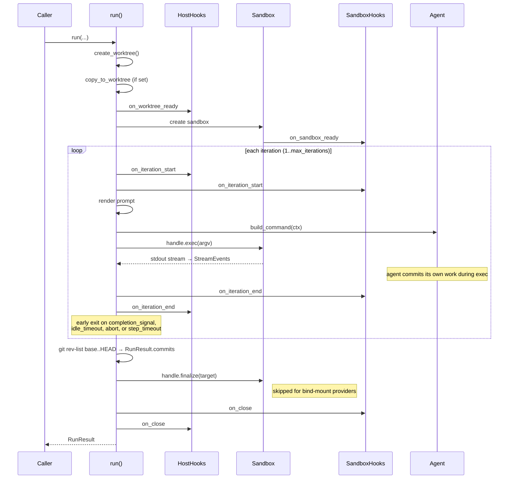

# Iteration loop diagram

Sequence diagram for the full `run()` lifecycle.

---

## See also

- [How it works](how-it-works.md) — phase-by-phase lifecycle narrative.
- [Prompts](prompts.md) — where prompt rendering fits into the loop.
- [Sandbox providers](sandbox-providers.md) — provider lifecycle details.
