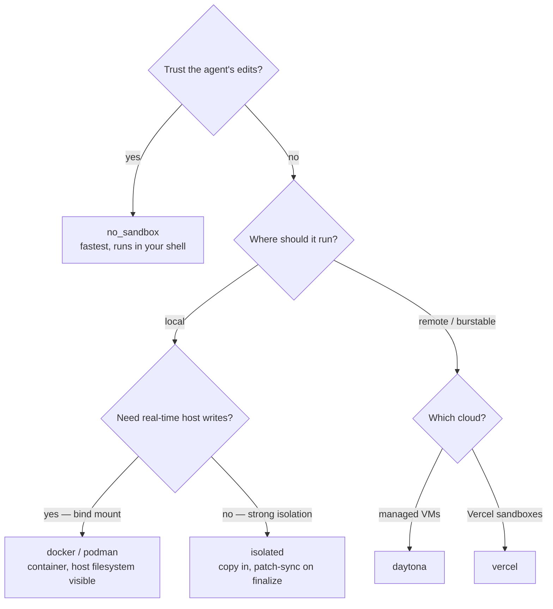

# Sandbox Provider Usage

Provider selection and import examples for Eden's in-tree sandbox providers. See [Sandbox providers](sandbox-providers.md) for the provider matrix and per-provider behavior.

---

## Choosing a provider



## Importing

Every provider lives at `eden.sandboxes.<name>` and exposes a single public name: `provider`. The conventional import alias gives readable call sites:

```python
from eden.sandboxes.no_sandbox import provider as no_sandbox
from eden.sandboxes.docker import provider as docker_provider
from eden.sandboxes.podman import provider as podman_provider
from eden.sandboxes.isolated import provider as isolated_provider
from eden.sandboxes.daytona import provider as daytona_provider
from eden.sandboxes.vercel import provider as vercel_provider
from eden.sandboxes.forkd import provider as forkd_provider
```

`run(sandbox=...)` takes a `SandboxProvider` *instance* — call the factory:

```python
from eden import run, simulated_agent
from eden.sandboxes.docker import provider as docker_provider

result = run(
    agent=simulated_agent(),
    sandbox=docker_provider(image="my-image:latest"),
    prompt="say hi",
)
```

## See also

- [Sandbox providers](sandbox-providers.md) — provider matrix and per-provider behavior.
- [Configuration](configuration.md) — env vars used by cloud providers.
- [How it works](how-it-works.md) — sandbox lifecycle and finalization.
