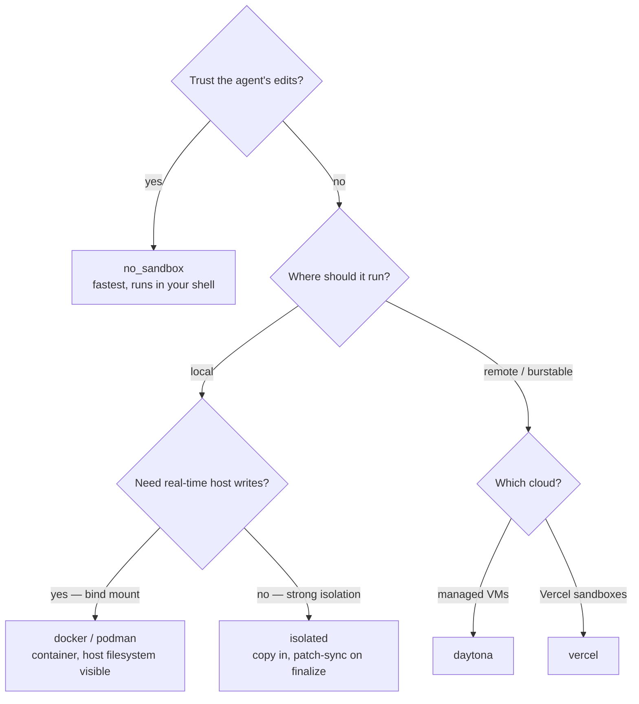

# Sandbox providers

Eden ships six sandbox providers covering local, isolated, and cloud execution. Each is a `provider()` factory that returns a `SandboxProvider` instance to pass into [`run(sandbox=...)`](python-api.md#run).

---

## Provider matrix

| Provider | Kind | Mounts host? | Network? | Side effects on host? | When to use |
|---|---|---|---|---|---|
| `no_sandbox` | bind-mount | yes (worktree path) | yes | yes (changes on host filesystem) | Trusted code, fastest iteration. |
| `docker` | bind-mount | yes (bind mount) | configurable | confined to mount | Untrusted code on Linux/macOS. |
| `podman` | bind-mount | yes (bind mount) | configurable | confined to mount | Same as `docker`, rootless. |
| `isolated` | patch-sync | no (copy + diff) | yes | none until `finalize()` | Strong isolation on a single host. |
| `daytona` | cloud (REST) | no (REST upload) | yes | none until `finalize()` | Burstable cloud capacity. |
| `vercel` | cloud (REST) | no (REST upload) | yes | none until `finalize()` | Vercel-managed sandboxes. |

Each provider's `kind` (`"none"`, `"bind_mount"`, or `"isolated"`) controls how `create_sandbox` and `run()` resolve the default branch strategy and whether the orchestrator calls `handle.finalize(...)` after the run. See [how-it-works.md](how-it-works.md) for the full lifecycle.

## Choosing a provider



## Importing

Every provider lives at `eden.sandboxes.<name>` and exposes a single public name: `provider`. The conventional import alias gives readable call sites:

```python
from eden.sandboxes.no_sandbox import provider as no_sandbox
from eden.sandboxes.docker import provider as docker_provider
from eden.sandboxes.podman import provider as podman_provider
from eden.sandboxes.isolated import provider as isolated_provider
from eden.sandboxes.daytona import provider as daytona_provider
from eden.sandboxes.vercel import provider as vercel_provider
```

`run(sandbox=...)` takes a `SandboxProvider` *instance* — call the factory:

```python
from eden import run, simulated_agent
from eden.sandboxes.docker import provider as docker_provider

result = run(
    agent=simulated_agent(),
    sandbox=docker_provider(image="my-image:latest"),
    prompt="say hi",
)
```

## `no_sandbox`

```python
from eden.sandboxes.no_sandbox import provider as no_sandbox

run(..., sandbox=no_sandbox())
```

### Signature

```python
def provider() -> SandboxProvider: ...
```

No arguments. Runs commands directly on the host via `subprocess` with `shell=True`, using the worktree path as the default `cwd`. `kind` is `"none"`.

### What it does

Spawns each `exec(cmd)` call as a host shell subprocess. `copy_file_in` / `copy_file_out` are direct `shutil.copy2` calls. There is no isolation: the agent sees your real filesystem, network, and environment.

### When to use

- Trusted code where you want zero overhead.
- Fastest iteration during agent development — no container build, no REST round-trip.
- The default for examples and the `simulated_agent` smoke test.

### When not to use

- Any time the agent could touch files outside the worktree (it can: `shell=True` plus host process means it has your full permissions).
- Any time you need reproducible environment isolation. Use `docker` or `isolated` instead.

## `docker`

```python
from eden.sandboxes.docker import provider as docker_provider

run(..., sandbox=docker_provider(image="my-image:latest"))
```

### Signature

```python
def provider(
    *,
    image: str,
    mounts: tuple[Mount, ...] | None = None,
    env: Mapping[str, str] | None = None,
    network: str | None = None,
) -> SandboxProvider: ...
```

- `image` — container image (must already be built; the provider does not build).
- `mounts` — extra bind mounts beyond the worktree itself. See [`Mount`](python-api.md#mount).
- `env` — environment variables propagated into the container.
- `network` — Docker `--network` flag value (e.g. `"host"`, `"none"`). `None` keeps Docker's default bridge.

### What it does

Creates a long-running container that bind-mounts the worktree path. Each `handle.exec(cmd)` runs as `docker exec` against that container. Reads and writes happen in-place on the host filesystem because the worktree is bind-mounted — no `finalize()` step.

### When to use

- Untrusted code on Linux/macOS where you want process and filesystem isolation but still want fast in-place commits.
- Reproducible base images (Dockerfile pinned to a tag).
- Networked agents that need controlled DNS/proxy via the `network` flag.

### When not to use

- macOS-only Apple Silicon hosts where bind-mount performance matters more than isolation — switch to `no_sandbox` for pure-iteration workloads.
- Environments without a Docker daemon. Use `podman` (rootless) or `isolated` (no daemon).

## `podman`

```python
from eden.sandboxes.podman import provider as podman_provider

run(..., sandbox=podman_provider(image="my-image:latest"))
```

### Signature

Identical to `docker`:

```python
def provider(
    *,
    image: str,
    mounts: tuple[Mount, ...] | None = None,
    env: Mapping[str, str] | None = None,
    network: str | None = None,
) -> SandboxProvider: ...
```

### What it does

Same lifecycle as `docker` but invokes the `podman` binary instead of `docker`. Rootless by default, suitable for environments without a privileged daemon.

### When to use

- Same use cases as `docker`, but on hosts where Docker isn't available or rootless isolation is preferred.
- CI environments that ship `podman` (e.g. RHEL-family runners).

### When not to use

- macOS hosts without a Podman machine. Eden does not auto-provision the VM; configure it yourself first.

## `isolated`

```python
from eden.sandboxes.isolated import provider as isolated_provider

run(..., sandbox=isolated_provider())
```

### Signature

```python
def provider(*, base_dir: Path | None = None) -> SandboxProvider: ...
```

- `base_dir` — root directory under which each run carves a fresh sub-directory. Defaults to `<host_repo>/.eden/isolated/`.

### What it does

Copies the worktree (excluding `.git` and `.eden`) into a fresh tmp directory, snapshots the file hashes as a baseline, then runs the agent there. Each `exec(cmd)` is a host `/bin/sh -c <cmd>` whose `cwd` defaults to the isolated copy. After the run, `finalize(target)` re-snapshots, computes a diff, and patches the host worktree with the changed/added/removed files.

### When to use

- Strong isolation on a single host without containers or daemons — useful for `claude-code`-style agents that you don't want touching `.eden/` or `.git/` directly.
- Local debugging of patch-sync semantics that the cloud providers also use.

### When not to use

- Workloads that run system-level installs you want torn down between iterations. The isolated copy is a plain directory; nothing is rolled back automatically beyond what `finalize()`'s diff produces.

## `daytona`

```python
from eden.sandboxes.daytona import provider as daytona_provider

run(..., sandbox=daytona_provider())
```

### Signature

```python
def provider(
    *,
    image: str = "ubuntu:24.04",
    api_key: str | None = None,
    organization_id: str | None = None,
    base_url: str | None = None,
    env: Mapping[str, str] | None = None,
    timeout: float = 60.0,
) -> SandboxProvider: ...
```

- `image` — container image used by the Daytona sandbox. Defaults to `ubuntu:24.04`.
- `api_key` — Daytona API key. Falls back to the `DAYTONA_API_KEY` env var. Required at sandbox-create time.
- `organization_id` — set the `X-Daytona-Organization-ID` header. Falls back to `DAYTONA_ORGANIZATION_ID`.
- `base_url` — override the API endpoint. Falls back to `DAYTONA_API_URL`. Defaults to `https://api.daytona.io`.
- `env` — environment variables forwarded to the sandbox at create time (merged with `CreateOptions.env` from the orchestrator).
- `timeout` — per-request HTTP timeout in seconds. Default `60.0`.

`ProviderUnavailable` is raised at `create()` time (not at factory time) when no API key is found — this lets you import the factory without credentials in scope.

### What it does

Provisions a Daytona cloud sandbox via REST (`POST /api/sandbox`), uploads the host worktree contents base64-encoded, and snapshots the remote tree as the baseline. Each `handle.exec(cmd)` is `POST /toolbox/<id>/process/execute`. `finalize(target)` re-snapshots remotely (via `find ... -exec sha256sum`), pulls each changed file, and patches the host worktree.

### When to use

- Burstable cloud capacity where a single host machine isn't enough.
- Cross-region/multi-region testing where the agent should run far from your dev box.
- Workloads that need a heavier image than your laptop can host.

### When not to use

- Latency-sensitive iteration loops. Every `exec` is a REST round-trip; tight loops are noticeably slower than local providers.
- Environments where outbound HTTPS to `api.daytona.io` (or your override) is blocked.

See [ADR 0001 — Finalizing vs. direct handles](adr/0001-finalizing-vs-direct-handles.md) for the patch-sync rationale.

## `vercel`

```python
from eden.sandboxes.vercel import provider as vercel_provider

run(..., sandbox=vercel_provider())
```

### Signature

```python
def provider(
    *,
    runtime: str = "node24",
    access_token: str | None = None,
    team_id: str | None = None,
    base_url: str | None = None,
    env: Mapping[str, str] | None = None,
    timeout: float = 60.0,
) -> SandboxProvider: ...
```

- `runtime` — Vercel sandbox runtime label. Defaults to `node24`.
- `access_token` — Vercel API token. Falls back to `VERCEL_TOKEN`. Required at sandbox-create time.
- `team_id` — sent as `?teamId=…` on every request. Falls back to `VERCEL_TEAM_ID`.
- `base_url` — override the API endpoint. Falls back to `VERCEL_API_URL`. Defaults to `https://api.vercel.com`.
- `env` — environment variables forwarded to the sandbox at create time.
- `timeout` — per-request HTTP timeout in seconds. Default `60.0`.

`ProviderUnavailable` is raised at `create()` time when no `access_token` is found.

### What it does

Provisions a Vercel sandbox via `POST /v1/sandboxes`, uploads the worktree base64-encoded, snapshots the baseline, and runs each `exec(cmd)` as `POST /v1/sandboxes/<id>/exec`. `finalize(target)` follows the same diff/pull/apply flow as `daytona`.

### When to use

- Vercel-native workflows where the team already has a Vercel token in scope.
- Same burstable-cloud reasoning as `daytona`.

### When not to use

- Latency-sensitive iteration loops (same REST cost as `daytona`).
- Environments where outbound HTTPS to `api.vercel.com` (or your override) is blocked.

## See also

- [Custom providers](custom-providers.md) — implementing your own `SandboxProvider` and `IsolatedSandboxHandle`.
- [Configuration](configuration.md) — the env vars each cloud provider falls back to.
- [Python API: `Mount`, `BranchStrategy`, `FinalizeResult`](python-api.md#configuration-types) — provider-agnostic types.
- [How it works](how-it-works.md) — when `finalize()` runs and how the orchestrator detects bind-mount vs isolated handles.
